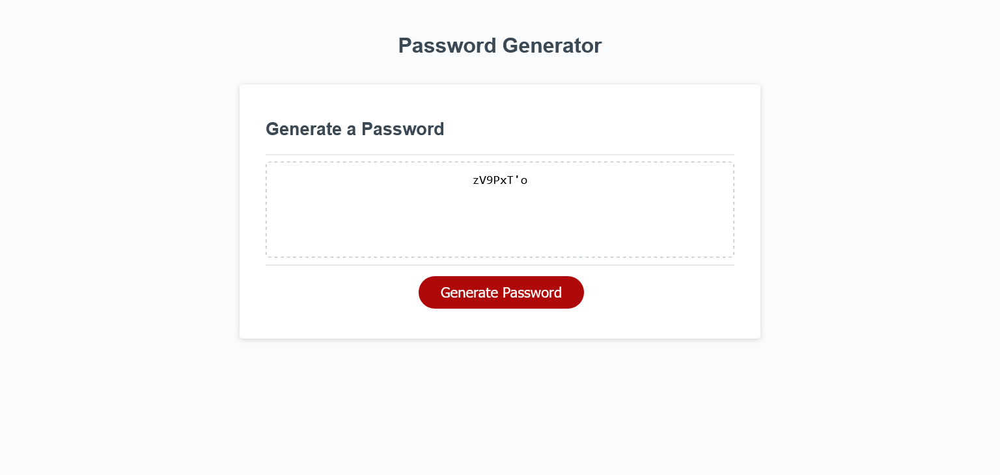

# JAVASCRIPT PASSWORD GENERATOR

## Table of contents

- [Overview](#overview)
  - [The challenge](#the-challenge)
  - [User Story](#user-story)
  - [Acceptance Criteria](#acceptance-criteria)
  - [Screenshot](#screenshot)
  - [Links](#links)
- [My process](#my-process)
  - [Built with](#built-with)
  - [What I learned](#what-i-learned)
  - [Continued development](#continued-development)
  - [Useful resources](#useful-resources)
- [Author](#author)

## Overview

### The challenge

This challenge was to build a password generator function. The HTML markup and CSS were provided, as well as a javascript skeleton. The javascript file included a writePassword() function that in turn called a generatePassword() function that was
undefined. After completing the generatePassword() function, users should be able to:

- Enter desired password parameters, then receive a password that meets those parameters
- Repeat this process as many times as they like

### User Story

```
AS AN employee with access to sensitive data
I WANT to randomly generate a password that meets certain criteria
SO THAT I can create a strong password that provides greater security
```

## Acceptance Criteria

```
GIVEN I need a new, secure password
WHEN I click the button to generate a password
THEN I am presented with a series of prompts for password criteria
WHEN prompted for password criteria
THEN I select which criteria to include in the password
WHEN prompted for the length of the password
THEN I choose a length of at least 8 characters and no more than 128 characters
WHEN asked for character types to include in the password
THEN I confirm whether or not to include lowercase, uppercase, numeric, and/or special characters
WHEN I answer each prompt
THEN my input should be validated and at least one character type should be selected
WHEN all prompts are answered
THEN a password is generated that matches the selected criteria
WHEN the password is generated
THEN the password is either displayed in an alert or written to the page
```

### Screenshot



### Links

- Solution URL: [GitHub](https://github.com/snelson-seattle/javascript-password-generator)
- Live Site URL: [GitHub Pages](https://snelson-seattle.github.io/javascript-password-generator/)

## My process

### Built with

- Javascript

### What I learned

This challenge was good practice for input validation, looping, built-in javascript array functions, and recursive function calls.

I'm particularly proud of this function I wrote to prompt the user for the password length. It has input validation to make sure the user is only able to provide valid input, and it uses recursion to continually execute until the user provides proper values.

```js
function getLength() {
  let length = prompt(
    "Enter your desired password length (between 8 and 128 characters)"
  );
  length = parseInt(length);
  if (length < 8 || length > 128 || isNaN(length)) {
    alert("You must enter a numerical between 8 and 128!");
    getLength();
  } else {
    return length;
  }
}
```

### Continued development

Given that the frontend markup for this challenge was already provided, I would like to rebuild the frontend with my own styling.

### Useful resources

- [MDN Docs: Recursion ](https://developer.mozilla.org/en-US/docs/Glossary/Recursion) - This helped me understand recursion in javascript which was very useful in this project.

## Author

- Website - [Scott E. Nelson](https://www.scottenelson.com)
- GitHub - [snelson-seattle](https://github.com/snelson-seattle)
- LinkedIn - [Scott E. Nelson](https://www.linkedin.com/in/scottenelson)
